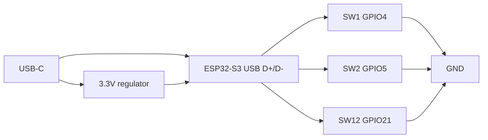

# Hardware

Target board: **ESP32-S3-WROOM-1** with USB-C. Classic ESP32 (USB-UART bridge) is supported in firmware (`pio run -e esp32`) but native USB on S3 is the intended product.

## Switch wiring

Use **2-pin** mechanical switches (Cherry MX 2-pin, Kailh Choc 2-pin, or similar). Do not use a matrix.

- Pin A → GPIO (see netlist)
- Pin B → GND
- Firmware enables internal pull-ups; closed switch reads LOW

9-key variant: populate SW1–SW9 and build `esp32s3_9key`.

## PCB diagram

Open [hardware/pcb-top.svg](../hardware/pcb-top.svg) for the 3×4 mechanical view.

## Files

- [BOM](../hardware/bom.csv)
- [Netlist](../hardware/netlist.csv)
- [KiCad schematic stub](../hardware/kicad/codedeck.kicad_sch)

## Design notes

- Keep USB D+/D- short and equal length; do not reuse GPIO 19/20 for keys.
- Avoid strapping pins 0, 3, 45, 46 for switches.
- Default Arduino partition table includes two OTA slots so the Mac app can update firmware without a USB-UART bootloader dance.
- Decouple 3V3 at the module (100 nF + 10 µF).
- USB-C CC1 and CC2 each get 5.1 kΩ to GND.

Suggested outline: **100 × 70 mm**, switches on 19.05 mm MX pitch, module and USB-C on the right edge.
